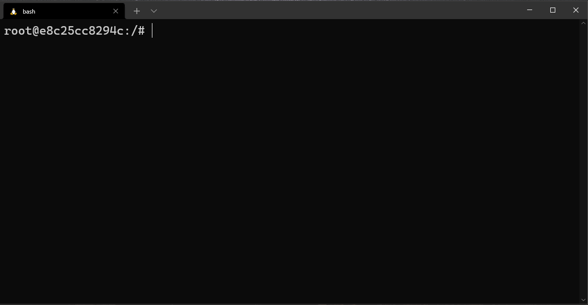

   




# Table of Contents
1. [Installation](#installation)
2. [Usage](#usage)
3. [Commands](#commands)
4. [How to set terraform version](#how-to-set-terraform-version)

# Terrafun
Terrafun is a tool for managing terraform versions. It enables seemless switching between different terraform versions which can be controlled by an environment variable, file, or user profile. It has been written in PowerShell but has been designed to support being used across multiple platforms and from different shells.

# Features
* terraform version management

# Installation


Once you have [PowerShell installed](https://docs.microsoft.com/en-us/powershell/scripting/install/installing-powershell?view=powershell-7.1) this module can be installed from the from the [PowerShell Gallery](https://www.powershellgallery.com/packages/Terrafun/).

## Supported platforms:

| OS        | Edition           | Build  |
| :------------- |:-------------:| -----|
| Windows  | `Windows PowerShell (v5)` | [](https://dev.azure.com/dougbw/terrafun/_build/latest?definitionId=29&branchName=main) |
| Windows | `PowerShell Core (v6+)` | [](https://dev.azure.com/dougbw/terrafun/_build/latest?definitionId=29&branchName=main) |
| Linux | `PowerShell Core (v6+)` | [](https://dev.azure.com/dougbw/terrafun/_build/latest?definitionId=29&branchName=main) |
| MacOs | `PowerShell Core (v6+)` | [](https://dev.azure.com/dougbw/terrafun/_build/latest?definitionId=29&branchName=main) |

## Installation (in pwsh)
```powershell
Install-Module terrafun -Force
```

## Installation (in anything else)
```bash
pwsh -c "Install-Module terrafun -Force"
```

## Update (in pwsh)
```powershell
Uninstall-Module -Name terrafun -AllVersions -Force
Install-Module terrafun -Force
```

# Usage

Install the module and simply run `tf` in place of `terraform`. 
 E.g:
```powershell
tf version
tf init
tf plan
tf apply
```

## Usage in other shells
You can use this from other shells (bash, zsh, sh, etc) through aliases providing you have a working PowerShell installation on your workstation. You can create aliases named to `terraform` instead of `tf` if you prefer.

* Install PowerShell on your machine
* Install the module using the instructions above
* Create an alias for your actual shell, examples below....

### bash alias
```bash
echo "alias tf='pwsh -c tf'" >> ~/.bashrc
alias tf='pwsh -c tf'
```
### zsh alias
```zsh
echo "alias tf='pwsh -c tf'" >> ~/.zshrc
alias tf='pwsh -c tf'
```

# Commands

Other than a couple of commands for version management you use `tf` exactly the same as if you are executing `terraform` directly.


| Command        | Description           |
| ------------- |:-------------:|
| `tf version list`     | list available terraform versions |
| `tf version <version>`      | set a specific version of terraform for the current directory      |
| `tf version <version> global` | set a specific version of terraform across your user profile      |


# How to set terraform version

There are three methods for selecting the desired version of terraform, prioritized in the following order:

1. Environment Variable
2. File
3. User Profile

## Environment Variable method
Set the `terraformversion` environment variable and you will get that version of terraform

### bash
```bash
terraformversion="1.0.0"
tf
```

### PowerShell
```powershell
$env:terraformversion = "1.0.0"
tf
```

## File method
Use the `tf version {version}` command which will save the version into a file named `.terraformversion` in the current directory.
```bash
tf version 0.13.5
```


## User Profile method
Use the `tf version {version} global` command which will store the version infomation in a config file within your user profile: `~/.terrafun/config.json`
```bash
tf version 0.13.5 global
```

# Binary install location
Binaries are downloaded to the following directory in your user profile:
```
 ~/.terrafun/terraform_{version}_{platform}_{arch}/terraform(.exe)
```